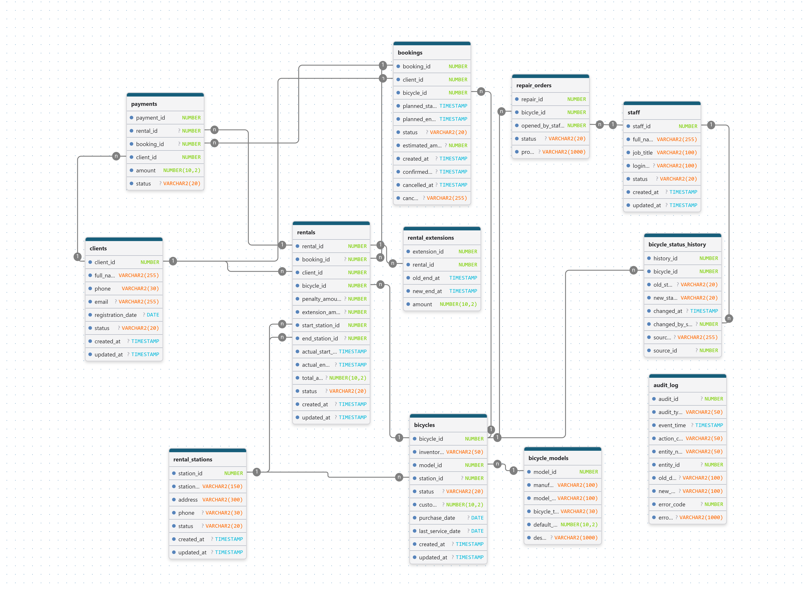
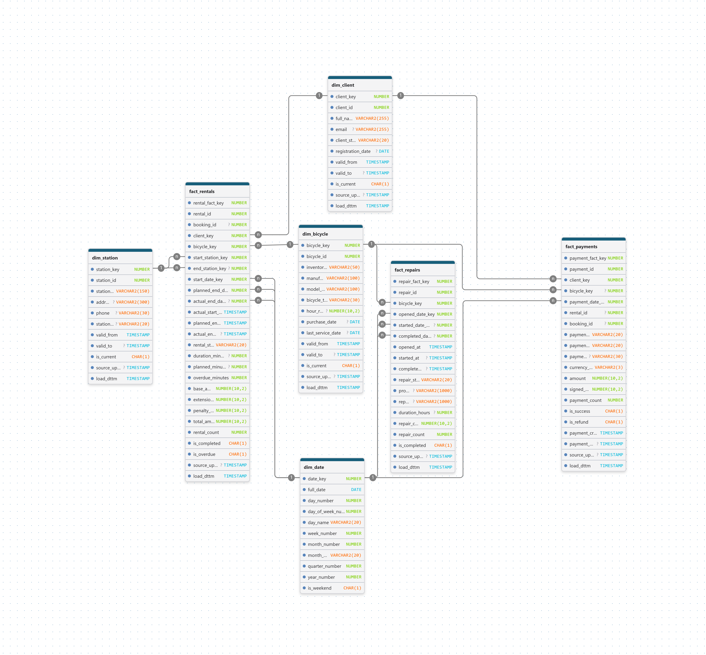

# Bike Rental Oracle PL/SQL

Система краткосрочной аренды велосипедов на Oracle Database.

## Возможности

- бронирование велосипеда;
- оплата аренды;
- продление аренды;
- управление ремонтом;
- аудит операций;
- OLTP и DWH;
- схема «звезда»;
- ETL через PL/SQL;
- витрины для BI.

## Архитектура

OLTP → STG → DIM/FACT

## Технологии

- Oracle Database
- SQL
- PL/SQL
- DBMS_SCHEDULER
- SCD Type 2
- Star Schema

## Структура репозитория

- `oltp/` — транзакционный слой;
- `dwh/` — хранилище данных и ETL;
- `docs/` — документация и диаграммы.

## Основные сущности OLTP

- CLIENTS
- BICYCLES
- BOOKINGS
- RENTALS
- PAYMENTS
- REPAIR_ORDERS
- AUDIT_LOG

## DWH

Измерения:

- DIM_DATE
- DIM_CLIENT
- DIM_BICYCLE
- DIM_STATION

Факты:

- FACT_RENTALS
- FACT_PAYMENTS
- FACT_REPAIRS
